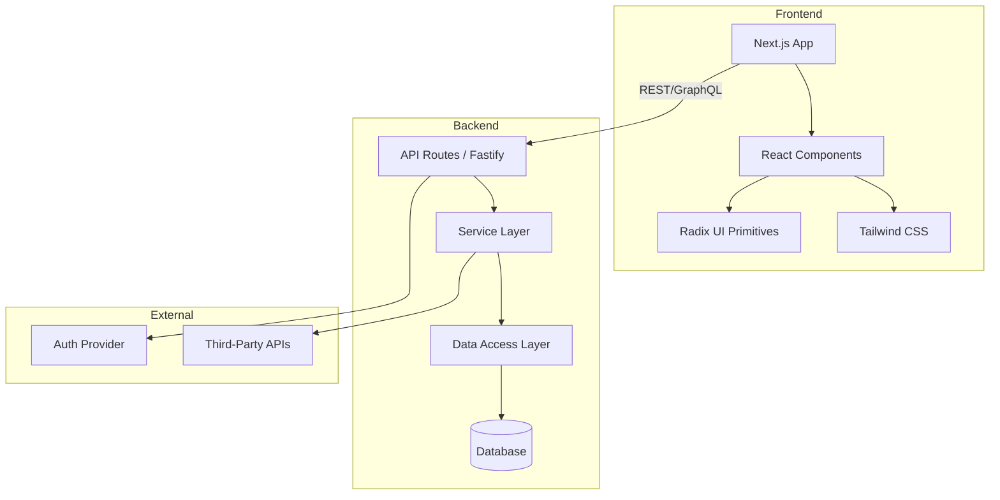
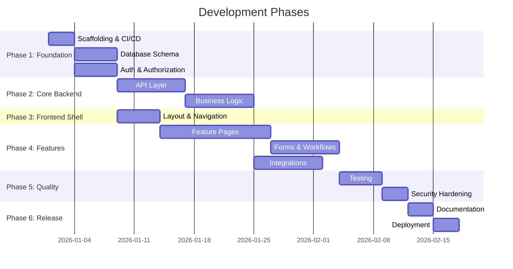
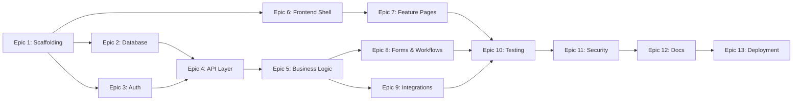
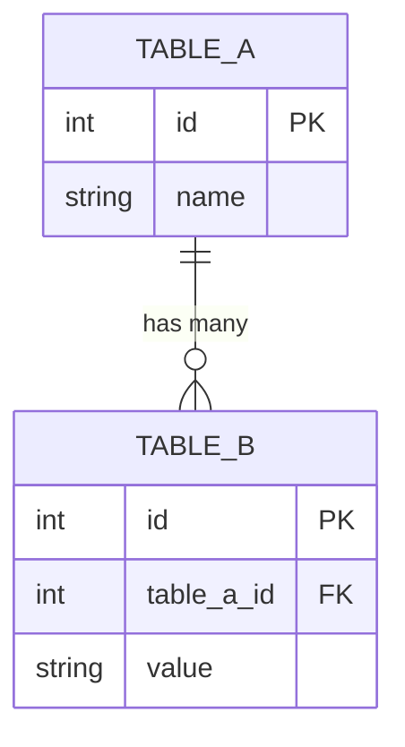

# Epic Planner

## Purpose

This skill drives the **Code Planner** agent through creating comprehensive, well-structured GitHub epics and sub-issues. It produces professional issue hierarchies with Mermaid diagrams, acceptance criteria, story points, dependencies, and a phased order of operations for complex systems.

## When to Use

- The user describes a feature, system, or project they want to build
- The user asks to "plan", "create epics", "break down", or "scope" work
- The user wants to organize development work into trackable GitHub issues
- After repo-scaffold has set up a new project
- When the modernization-planner skill has already analyzed a legacy codebase

## Required MCP Tools

| Tool | Purpose |
|------|---------|
| `mcp_github_issue_write` | Create epics and issues |
| `mcp_github_sub_issue_write` | Link sub-issues to parent epics |
| `mcp_github_issue_read` | Read existing issues to avoid duplicates |
| `mcp_github_get_me` | Get current user context |
| `mcp_context7_resolve-library-id` | Resolve library IDs for technical research |
| `mcp_context7_query-docs` | Fetch framework docs for accurate issue details |
| `mcp_tavily_tavily_search` | Web search for patterns, architecture, and best practices (preferred) |
| `fetch_webpage` | Fetch a specific URL when Tavily is unavailable or URL is already known |

## Labels

Create and use these labels on every issue. If the label doesn't exist in the repo, create it.

| Label | Color (hex) | Description |
|-------|-------------|-------------|
| `epic` | `#7057ff` | Top-level planning epic |
| `feature` | `#1d76db` | New feature or enhancement |
| `frontend` | `#0075ca` | React / UI / Tailwind work |
| `backend` | `#d93f0b` | Server-side / API work |
| `database` | `#0e8a16` | Schema, migrations, data access |
| `infra` | `#fbca04` | Docker, CI/CD, deployment config |
| `docs` | `#d4c5f9` | Documentation updates |
| `testing` | `#bfd4f2` | Test coverage and QA |
| `security` | `#b60205` | Security-related work |
| `blocked` | `#e4e669` | Waiting on another issue |

## Story Points (Fibonacci Scale)

| Points | Meaning | Example |
|--------|---------|---------|
| 1 | Trivial | Config change, copy update |
| 2 | Small | Simple component, single endpoint |
| 3 | Medium | Feature with tests, moderate complexity |
| 5 | Large | Multi-file feature, integration work |
| 8 | Very Large | Complex feature, significant refactor |
| 13 | Epic-sized | Should probably be split further |

---

## Workflow

### Step 0: Gather Context

#### 0a. Identify Target Repository
Determine the `owner/repo` for issue creation:
1. Check for existing git remote: `git remote -v`
2. Ask the user if not obvious: *"Which GitHub repository should I create these issues in?"*
3. Verify repo exists using `mcp_github_issue_read` on issue #1 (or list issues)

#### 0b. Research Sources — Ask the User

Present this prompt:
> **I can gather additional context to make the epics more detailed. Would you like me to:**
>
> 1. � **Read local documents** from a directory you specify? (I'll convert DOCX/PDF/XLSX to Markdown)
> 2. 🌐 **Research from the web** using URLs you provide?
> 3. 📚 **Look up library docs** via Context7 for frameworks you plan to use?
> 4. ⏩ **Skip research** — I have enough context from your description
>
> *You can choose multiple options.*

#### If user specifies a local docs directory:
1. Read the files in the provided directory
2. Extract requirements, business rules, and constraints

#### If user provides web URLs:
1. Use `fetch_webpage` for each URL
2. Extract relevant information

### Step 1: Understand the Scope

Analyze what the user has described:

1. **Is this a single feature or an entire system?**
   - Single feature → Create one epic with sub-issues
   - Entire system → Create a **Master Epic** with child epics (order of operations)

2. **Identify domains/bounded contexts**: Group related functionality
3. **Identify dependencies**: What must be built before what?
4. **Identify unknowns**: What needs more research or user clarification?

Ask clarifying questions if scope is ambiguous:
> - *"Is this a new feature in an existing app, or a new system from scratch?"*
> - *"Who are the users? What are the key user journeys?"*
> - *"Are there external systems or APIs you need to integrate with?"*
> - *"Do you have existing data/schemas to work with?"*

### Step 2: Plan the Epic Structure

Create a visual plan before writing any issues.

#### For a Single Feature Epic:
```
Epic: [Feature Name]
├── Sub-issue 1: [Setup / scaffolding]
├── Sub-issue 2: [Core implementation]
├── Sub-issue 3: [Secondary feature]
├── Sub-issue 4: [Tests]
├── Sub-issue 5: [Documentation]
└── Sub-issue 6: [Polish / edge cases]
```

#### For a Full System (Master Epic):
```
Master Epic: [System Name] — Order of Operations
├── Phase 1: Foundation
│   ├── Epic 1: Project Scaffolding & CI/CD
│   ├── Epic 2: Database Schema & Migrations
│   └── Epic 3: Authentication & Authorization
├── Phase 2: Core Backend
│   ├── Epic 4: API Layer
│   └── Epic 5: Business Logic & Services
├── Phase 3: Frontend Shell
│   └── Epic 6: Layout, Navigation & Design System
├── Phase 4: Features
│   ├── Epic 7: Feature Pages
│   ├── Epic 8: Forms & Workflows
│   └── Epic 9: Integrations
├── Phase 5: Quality
│   ├── Epic 10: Testing Strategy
│   └── Epic 11: Security Hardening
└── Phase 6: Release
    ├── Epic 12: Documentation (ARCHITECTURE.md, USER_GUIDE.md)
    └── Epic 13: Deployment & Migration
```

Present the plan to the user for approval before creating issues.

### Step 3: Create the Master Epic (if full system)

Use `mcp_github_issue_write` with method `create`:

**Title**: `[MASTER EPIC] {System Name} — Order of Operations`

**Body template**:

````markdown
## Executive Summary

{1-2 paragraph description of the system being built}

## Tech Stack

| Layer | Technology | Rationale |
|-------|-----------|-----------|
| Frontend | {e.g., Next.js 15 + Tailwind CSS + Radix UI} | {why} |
| Backend | {e.g., Node.js + Fastify + TypeScript} | {why} |
| Database | {e.g., PostgreSQL + Drizzle ORM} | {why} |
| Auth | {e.g., NextAuth.js + JWT} | {why} |
| Testing | {e.g., Vitest + Playwright} | {why} |
| CI/CD | {e.g., GitHub Actions} | {why} |

## Architecture Overview



## Order of Operations



## Epic Dependency Graph



## Child Epics

| # | Epic | Phase | Story Points | Status |
|---|------|-------|-------------|--------|
| 1 | {Epic 1 title} #{issue_number} | Phase 1 | {points} | 🔲 Not Started |
| 2 | {Epic 2 title} #{issue_number} | Phase 1 | {points} | 🔲 Not Started |
| ... | ... | ... | ... | ... |

## Total Estimated Story Points: {sum}

## Research Sources

{List of documents, URLs, and library docs consulted during planning}

## Risks & Mitigations

| Risk | Impact | Likelihood | Mitigation |
|------|--------|-----------|------------|
| {risk} | High/Medium/Low | High/Medium/Low | {mitigation} |

## Living Documents

- `docs/ARCHITECTURE.md` — Maintained by Code Issue agent during implementation
- `docs/USER_GUIDE.md` — Maintained by Code Issue agent during implementation
````

**Labels**: `epic`

### Step 4: Create Child Epics

For each child epic, use `mcp_github_issue_write` then link via `mcp_github_sub_issue_write`.

**Child Epic body template**:

````markdown
## Overview

{2-3 sentence description of what this epic accomplishes}

**Parent**: #{master_epic_number}
**Phase**: {phase number and name}
**Depends on**: #{dependency_epic_numbers}
**Blocked by**: {none or list}

## Scope

### In Scope
- {specific deliverable 1}
- {specific deliverable 2}

### Out of Scope
- {explicitly excluded item}

## Sub-Issues

| # | Issue | Story Points | Status |
|---|-------|-------------|--------|
| 1 | {title} #{number} | {points} | 🔲 |
| 2 | {title} #{number} | {points} | 🔲 |

## Architecture Notes

```mermaid
{relevant diagram — component, sequence, ER, or flow}
```

## Acceptance Criteria (Epic-level)

- [ ] All sub-issues completed and PRs merged
- [ ] Test coverage ≥80% for all new code
- [ ] No security vulnerabilities (OWASP scan clean)
- [ ] `docs/ARCHITECTURE.md` updated with relevant sections
- [ ] `docs/USER_GUIDE.md` updated if user-facing changes

## Total Story Points: {sum}
````

### Step 5: Create Sub-Issues

For each sub-issue under every epic, use `mcp_github_issue_write` then `mcp_github_sub_issue_write`.

**Sub-Issue body template**:

````markdown
## Description

{Clear, actionable description of what needs to be done}

**Parent Epic**: #{epic_number}
**Story Points**: {1|2|3|5|8|13}

## Context

{Background information, business rules, or technical context needed to implement this}

## Acceptance Criteria

- [ ] {Specific, testable condition 1}
- [ ] {Specific, testable condition 2}
- [ ] {Specific, testable condition 3}
- [ ] Unit tests written and passing (≥80% coverage for new code)
- [ ] No linting errors
- [ ] Self-review checklist completed

## Technical Details

### Files to Create/Modify
- `path/to/file.ts` — {what changes}

### API Contract (if applicable)
```
METHOD /api/endpoint
Request: { field: type }
Response: { field: type }
```

### Component Hierarchy (if UI)
```
ParentComponent
├── ChildComponent
│   ├── SubComponent
│   └── SubComponent
└── SiblingComponent
```

### Data Model (if applicable)


## Dependencies

- **Blocked by**: #{issue_numbers} (must be completed first)
- **Blocks**: #{issue_numbers} (depends on this)

## Definition of Done

- [ ] Code implemented and self-reviewed
- [ ] Unit tests pass with ≥80% coverage
- [ ] Linting clean
- [ ] PR created with `Closes #{this_issue_number}`
- [ ] `docs/ARCHITECTURE.md` updated (if architectural changes)
- [ ] `docs/USER_GUIDE.md` updated (if user-facing changes)
````

### Step 6: Update Master Epic

After all child epics and sub-issues are created:

1. Use `mcp_github_issue_write` with method `update` on the Master Epic
2. Fill in all issue numbers in the Child Epics table
3. Update the Mermaid diagrams with actual issue references
4. Calculate and fill in total story points

### Step 7: Handoff

Present to the user:

```markdown
## Epic Planning Complete

### Master Epic
- #{master_epic_number}: {title}

### Child Epics ({count})
| Epic | Issues | Story Points |
|------|--------|-------------|
| #{number}: {title} | {sub_count} | {points} |
| ... | ... | ... |

### Total
- **Epics**: {count}
- **Sub-issues**: {total_count}
- **Story points**: {total_points}
- **Estimated phases**: {phase_count}

### Recommended Starting Point
> Begin with **Epic #{first_epic}** (Phase 1: {name}).
> Use `@Code Issue resolve epic #{first_epic}` to start implementation.

### Living Documents
- `docs/ARCHITECTURE.md` — will be maintained by Code Issue agent
- `docs/USER_GUIDE.md` — will be maintained by Code Issue agent
```

---

## Issue Writing Best Practices

These rules apply to ALL issues created by this skill:

1. **Titles are actionable** — Start with a verb: "Implement", "Create", "Add", "Configure", "Design"
2. **Acceptance criteria are testable** — Each criterion can be verified as pass/fail
3. **Business logic is explicit** — Never assume the developer knows the domain. Spell out every rule, formula, and workflow
4. **Diagrams enhance clarity** — Use Mermaid diagrams for architecture, data flow, sequences, and ER relationships
5. **Dependencies are bidirectional** — Every "blocked by" has a corresponding "blocks"
6. **Story points reflect complexity** — Not time. A 5-point issue is 5x more complex than a 1-point issue
7. **No issue should exceed 13 points** — If it does, split it into smaller issues
8. **Include file paths** — Tell the developer exactly which files to create or modify
9. **Include code contracts** — API request/response shapes, component props, function signatures
10. **Reference research sources** — Link to docs, local files, or URLs consulted

## Error Recovery

| Scenario | Action |
|----------|--------|
| GitHub API rate limited | Pause 60s, retry with exponential backoff |
| Issue creation fails | Log error, continue with remaining issues, retry failed ones at end |
| Sub-issue linking fails | Note the parent-child relationship in the issue body as fallback |
| User rejects epic structure | Re-interview, adjust scope, regenerate |

## Tips

- Create all epics first, then sub-issues, then update the master epic — this ensures all issue numbers are available for cross-referencing
- Use `mcp_github_issue_read` to check for existing issues before creating duplicates
- For very large systems (>100 issues), batch creation and add delays to avoid rate limiting
- The Gantt chart dates in the Master Epic are illustrative — use relative timing ("after X") rather than absolute dates
- Always create the `docs` epic last — it depends on knowing what was built
