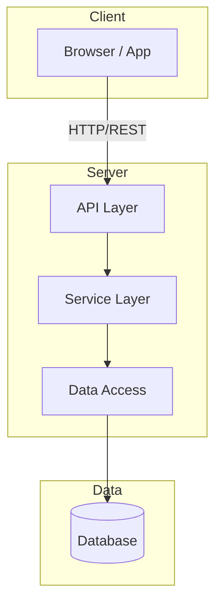

# Architecture Document

> **Living Document** — This document is maintained by the Code Issue agent during development. It is initially created by the Code Planner agent and updated as the system evolves.

## Table of Contents

- [Overview](#overview)
- [Tech Stack](#tech-stack)
- [System Architecture](#system-architecture)
- [Project Structure](#project-structure)
- [Data Model](#data-model)
- [API Reference](#api-reference)
- [Authentication & Authorization](#authentication--authorization)
- [External Integrations](#external-integrations)
- [Deployment](#deployment)
- [Development Workflow](#development-workflow)
- [Decision Log](#decision-log)

---

## Overview

<!-- Brief description of the system, its purpose, and its users -->

**Project**: {project-name}
**Created**: {date}
**Status**: In Development

## Tech Stack

| Layer | Technology | Version | Purpose |
|-------|-----------|---------|---------|
| Frontend | | | |
| Backend | | | |
| Database | | | |
| Auth | | | |
| Testing | | | |
| CI/CD | | | |

## System Architecture

<!-- High-level architecture diagram -->



## Project Structure

```
{project-name}/
├── src/
│   ├── ...
├── tests/
│   ├── ...
├── docs/
│   ├── ARCHITECTURE.md    ← You are here
│   └── USER_GUIDE.md
├── .github/
│   ├── workflows/
│   └── ISSUE_TEMPLATE/
└── package.json / build.gradle / etc.
```

## Data Model

<!-- Entity-Relationship diagram -->

```mermaid
erDiagram
    %% Add entities as the data model evolves
```

## API Reference

<!-- Document API endpoints as they are created -->

### Endpoints

| Method | Path | Description | Auth |
|--------|------|-------------|------|
| | | | |

### Request/Response Examples

<!-- Add examples as endpoints are implemented -->

## Authentication & Authorization

<!-- Document auth strategy, roles, and permissions -->

### Strategy
<!-- OAuth2, JWT, Session, etc. -->

### Roles & Permissions

| Role | Permissions |
|------|------------|
| | |

## External Integrations

<!-- Document third-party services and APIs -->

| Service | Purpose | Protocol | Status |
|---------|---------|----------|--------|
| | | | |

## Deployment

### Prerequisites
<!-- What's needed to deploy -->

### Environment Variables

| Variable | Required | Default | Description |
|----------|----------|---------|-------------|
| | | | |

### Build & Deploy

```bash
# Build
# Deploy
# Verify
```

### Infrastructure

```mermaid
graph LR
    %% Add infrastructure diagram as deployment is configured
```

## Development Workflow

### Getting Started

```bash
# Clone and setup
git clone <repo-url>
cd <project-name>
# Install dependencies
# Start development server
```

### Commands

| Command | Purpose |
|---------|---------|
| | |

### Branch Strategy

- `main` — Production-ready code
- `feature/issue-{N}-{desc}` — Feature branches per issue
- PRs require review before merge

## Decision Log

<!-- Record architectural decisions as they are made -->

| Date | Decision | Rationale | Alternatives Considered |
|------|----------|-----------|------------------------|
| {date} | {initial tech stack choice} | {why} | {what else was considered} |
