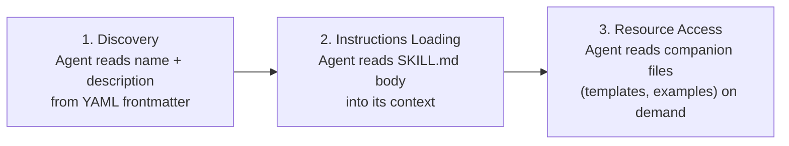
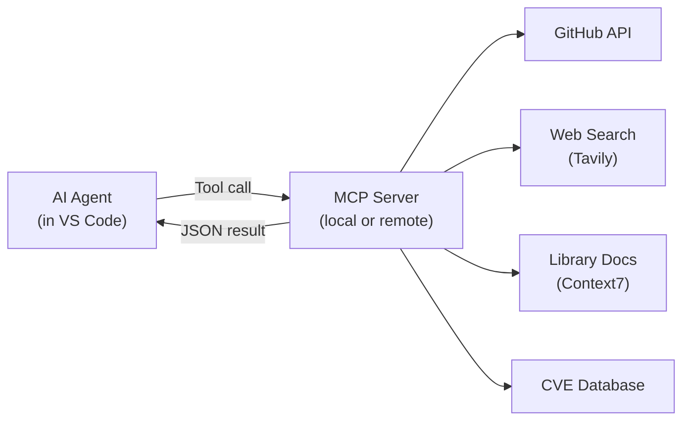
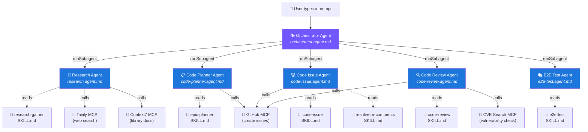
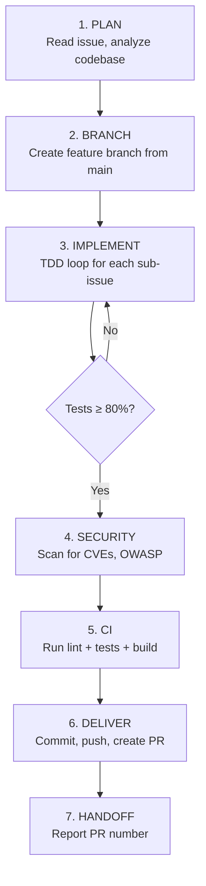
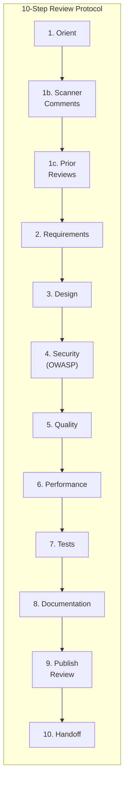
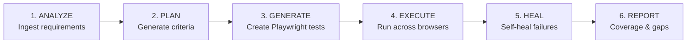
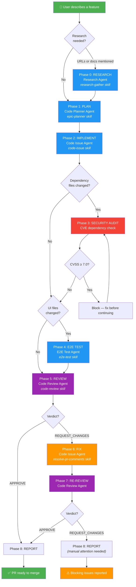
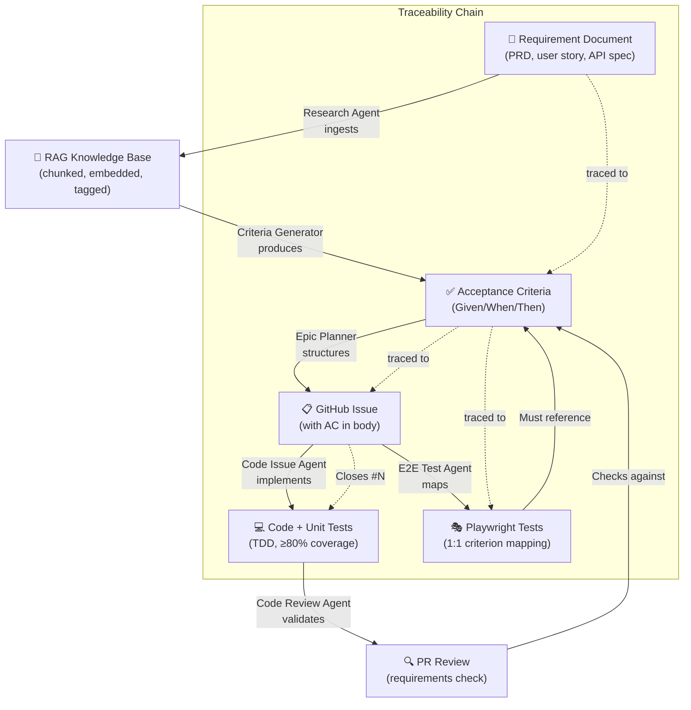

# Autonomous Development Pipeline

> **How TALOS uses GitHub Copilot agents, subagents, skills, and MCP tools to autonomously research, plan, implement, test, review, and fix code — all from a single prompt.**

---

## Table of Contents

- [Part 1: Concepts — How the Pieces Fit Together](#part-1-concepts--how-the-pieces-fit-together)
  - [What Is an Agent?](#what-is-an-agent)
  - [What Is a Subagent?](#what-is-a-subagent)
  - [What Is a Skill?](#what-is-a-skill)
  - [What Is an Instruction?](#what-is-an-instruction)
  - [What Is an MCP Tool?](#what-is-an-mcp-tool)
  - [How They Compose Together](#how-they-compose-together)
- [Part 2: The Agent Roster](#part-2-the-agent-roster)
  - [Orchestrator Agent](#orchestrator-agent)
  - [Research Agent](#research-agent)
  - [Code Planner Agent](#code-planner-agent)
  - [Code Issue Agent](#code-issue-agent)
  - [Code Review Agent](#code-review-agent)
  - [E2E Test Agent](#e2e-test-agent)
  - [Test Orchestrator Agent](#test-orchestrator-agent)
- [Part 3: The Skill Library](#part-3-the-skill-library)
  - [epic-planner](#epic-planner)
  - [code-issue](#code-issue)
  - [code-review](#code-review)
  - [research-gather](#research-gather)
  - [e2e-test](#e2e-test)
  - [resolve-pr-comments](#resolve-pr-comments)
  - [criteria-generator](#criteria-generator)
  - [repo-scaffold](#repo-scaffold)
  - [test-planner](#test-planner)
  - [test-reviewer](#test-reviewer)
- [Part 4: The MCP Tool Ecosystem](#part-4-the-mcp-tool-ecosystem)
- [Part 5: Instruction Files](#part-5-instruction-files)
- [Part 6: The Full Pipeline — End to End](#part-6-the-full-pipeline--end-to-end)
  - [Phase 0: Research](#phase-0-research)
  - [Phase 1: Plan](#phase-1-plan)
  - [Phase 2: Implement](#phase-2-implement)
  - [Phase 3: Security Audit](#phase-3-security-audit)
  - [Phase 4: E2E Test](#phase-4-e2e-test)
  - [Phase 5: Review](#phase-5-review)
  - [Phase 6: Fix](#phase-6-fix)
  - [Phase 7: Re-Review](#phase-7-re-review)
  - [Phase 8: Report](#phase-8-report)
- [Part 7: Traceability — From Requirement to Passing Test](#part-7-traceability--from-requirement-to-passing-test)
- [Part 8: Handling CodeQL and Security Findings](#part-8-handling-codeql-and-security-findings)
- [Part 9: Real-World Example Walk-Through](#part-9-real-world-example-walk-through)
- [Appendix A: File System Layout](#appendix-a-file-system-layout)
- [Appendix B: Quick Reference — Agent ↔ Skill ↔ Tool Matrix](#appendix-b-quick-reference--agent--skill--tool-matrix)

---

## Part 1: Concepts — How the Pieces Fit Together

This section explains the foundational building blocks of the autonomous development system from first principles. If you already understand VS Code Copilot customization, skip to [Part 2](#part-2-the-agent-roster).

### What Is an Agent?

An **agent** is a persistent AI persona with a defined role, a restricted set of tools, and specific instructions that govern its behavior. Agents are defined in `.agent.md` Markdown files stored in `.github/agents/`.

Think of an agent as a specialized team member. A "Code Review" agent behaves like a senior code reviewer — it reads PRs, checks requirements, evaluates security, and publishes review comments. It has access to GitHub tools for reading PRs and posting reviews, but it doesn't have permission to edit code files.

#### Agent File Structure

```yaml
# .github/agents/code-review.agent.md
---
name: Code Review                      # Display name in VS Code agent dropdown
description: "Senior code reviewer..." # Tooltip shown in the UI
argument-hint: "[PR number]"           # Placeholder text in chat input
tools:                                 # Allowed tool groups
  - read                               # Built-in: read files
  - search                             # Built-in: search workspace
  - github/*                           # All GitHub MCP tools
  - cve-search-mcp/*                   # CVE lookup MCP tools
handoffs:                              # Suggested next agents
  - label: Fix Review Comments
    agent: Code Issue
    prompt: Resolve the review comments...
agents:                                # Allowed subagents
  - Code Issue
---

# Agent body — system prompt instructions in Markdown
You are a Senior Code Reviewer...
```

**Key properties:**

| Property | Purpose |
|----------|---------|
| `name` | Identifier used in the agent dropdown and when invoking as a subagent |
| `tools` | Whitelist of available tools. `github/*` means all MCP tools from the `github` server. If a tool isn't listed, the agent cannot use it. |
| `agents` | Which other agents can be invoked as subagents (via `runSubagent`). Use `*` for all, `[]` for none. |
| `handoffs` | Buttons that appear after a response, suggesting the user switch to another agent. |
| Body | Markdown instructions that become the agent's system prompt. This defines its persona, workflow, and rules. |

**Where agents live:**

| Location | Scope |
|----------|-------|
| `.github/agents/` | Workspace — shared via version control |
| `~/.copilot/agents/` | User profile — personal, across all workspaces |
| `.claude/agents/` | Claude-compatible format (also detected by VS Code) |

> **Reference:** [VS Code — Custom Agents](https://code.visualstudio.com/docs/copilot/customization/custom-agents)

---

### What Is a Subagent?

A **subagent** is an agent invoked *by* another agent to handle an isolated subtask. The calling agent passes a prompt, the subagent works autonomously in its own context, and returns a single result.

```
┌──────────────────────────────────────────────────────────────┐
│  Orchestrator Agent (main session)                           │
│                                                              │
│  "Plan this feature"                                         │
│       │                                                      │
│       ├── runSubagent(Code Planner, "Create epics for...")   │
│       │       │                                              │
│       │       └── Code Planner works autonomously            │
│       │           └── Returns: "Epic #42, issues #43-#48"    │
│       │                                                      │
│       ├── runSubagent(Code Issue, "Implement epic #42...")    │
│       │       │                                              │
│       │       └── Code Issue works autonomously              │
│       │           └── Returns: "PR #50 created"              │
│       │                                                      │
│       └── runSubagent(Code Review, "Review PR #50...")       │
│               │                                              │
│               └── Code Review works autonomously             │
│                   └── Returns: "APPROVE"                     │
└──────────────────────────────────────────────────────────────┘
```

**Key characteristics:**

- **Context isolation** — Each subagent starts with a clean context. It only sees the prompt passed to it, not the calling agent's full conversation history. This prevents context pollution.
- **Synchronous execution** — The calling agent waits for the subagent to complete before continuing.
- **Single result** — The subagent returns one message. This forces it to summarize its work concisely.
- **Tool inheritance** — By default, a subagent inherits the parent's tools. If the subagent is a custom agent, its own tool list overrides the parent's.
- **Nesting** — By default, subagents cannot spawn further subagents (prevents infinite recursion). Enable `chat.subagents.allowInvocationsFromSubagents` for recursive patterns (max depth: 5).

#### Why Use Subagents?

| Without subagents | With subagents |
|-------------------|----------------|
| One agent does everything — context grows until it degrades | Each subtask gets a fresh context |
| Tool access is all-or-nothing | Each agent has only the tools it needs |
| Errors in one phase poison the whole session | Failures are isolated to the subagent |
| Can't parallelize | Independent subtasks can run in parallel |

> **Reference:** [VS Code — Subagents](https://code.visualstudio.com/docs/copilot/agents/subagents)

---

### What Is a Skill?

A **skill** is a reusable, portable set of instructions (and optionally scripts/resources) that teaches an agent how to perform a specific task. Skills are stored in directories under `.github/skills/` with a `SKILL.md` file.

If an agent is *who* does the work, a skill is *how* the work is done.

```
.github/skills/
├── code-issue/
│   └── SKILL.md          # Step-by-step workflow for implementing GitHub issues
├── code-review/
│   └── SKILL.md          # Multi-dimensional PR review protocol
├── epic-planner/
│   └── SKILL.md          # Epic creation with Mermaid diagrams and acceptance criteria
├── e2e-test/
│   └── SKILL.md          # Playwright test writing with Page Object Model
└── research-gather/
    └── SKILL.md           # Multi-source research compilation
```

#### Skill File Structure

```yaml
# .github/skills/code-issue/SKILL.md
---
name: code-issue
description: "Autonomous senior developer workflow for resolving GitHub issues..."
argument-hint: "[epic or issue number]"
---

# Code Issue Resolver

## Purpose
This skill drives the Code Issue agent through a complete development workflow...

## Workflow
### Step 1: Planning
1. Read the issue using `mcp_github_issue_read`
2. Analyze the codebase...

### Step 2: Branch Setup
...

### Step 3: Implementation Loop
...
```

#### How Skills Load (Three Levels)



1. **Discovery** — Copilot reads the skill's `name` and `description`. When the user asks "help me test the login page", Copilot matches this to a relevant skill based on its description.
2. **Instructions loading** — Copilot loads the `SKILL.md` body into context, gaining access to the step-by-step procedures.
3. **Resource access** — As Copilot works through the instructions, it reads companion files (templates, examples) only when referenced.

This progressive loading means many skills can exist without consuming context. Only what's relevant gets loaded.

#### Skills vs. Instructions vs. Agents

| Dimension | Agent (`.agent.md`) | Skill (`SKILL.md`) | Instruction (`.instructions.md`) |
|-----------|---------------------|---------------------|-----------------------------------|
| **Purpose** | Define a persona with tool access | Teach a specialized workflow | Set coding standards and guidelines |
| **Scope** | Active when selected or invoked as subagent | Loaded on-demand for specific tasks | Always-on or glob-pattern matched |
| **Content** | System prompt + tool config | Step-by-step procedures + resources | Coding rules and conventions |
| **Portability** | VS Code, Copilot CLI, cloud agents | Open standard ([agentskills.io](https://agentskills.io/)) | VS Code and GitHub.com only |
| **Has tools?** | Yes — tool whitelist | No — uses invoking agent's tools | No |
| **Example** | "You are a Senior Code Reviewer" | "Step 1: Read the PR. Step 2: Check requirements..." | "Use `date-fns` instead of `moment.js`" |

> **Reference:** [VS Code — Agent Skills](https://code.visualstudio.com/docs/copilot/customization/agent-skills)

---

### What Is an Instruction?

An **instruction** is a Markdown file that defines coding standards, conventions, or guidelines. Instructions are automatically injected into the AI's context based on file patterns or always-on rules.

```yaml
# .github/instructions/nextjs-tailwind.instructions.md
---
name: 'Next.js + Tailwind Standards'
description: 'Development standards for Next.js and Tailwind files'
applyTo: '**/*.tsx, **/*.ts, **/*.jsx, **/*.js, **/*.css'
---

# Next.js + Tailwind Development Standards
- Use the App Router pattern, not Pages Router
- Server Components by default, add "use client" only when needed
- Use Tailwind utility classes instead of custom CSS
...
```

**Key property:** `applyTo` — a glob pattern that determines when the instruction is injected. When the agent works on a `.tsx` file, instructions matching `**/*.tsx` are automatically included.

**This project's instructions:**

| File | Applies To | Purpose |
|------|-----------|---------|
| `go.instructions.md` | `**/*.go, **/go.mod, **/go.sum` | Idiomatic Go practices |
| `nextjs-tailwind.instructions.md` | `**/*.tsx, **/*.ts, **/*.jsx, **/*.js, **/*.css` | Next.js + Tailwind standards |
| `playwright-typescript.instructions.md` | *(all files)* | Playwright test conventions |
| `python.instructions.md` | `**/*.py` | Python coding conventions |
| `gilfoyle-code-review.instructions.md` | `**` (all files) | Sardonic code review persona (for entertainment) |

> **Reference:** [VS Code — Custom Instructions](https://code.visualstudio.com/docs/copilot/customization/custom-instructions)

---

### What Is an MCP Tool?

**MCP (Model Context Protocol)** is an open standard that lets AI agents interact with external services through structured tool calls. An MCP server exposes tools (functions) that agents can invoke — reading GitHub issues, searching the web, querying databases, etc.



In VS Code, MCP servers are configured in `.vscode/mcp.json` (workspace) or the user-level settings. Agents reference them in their `tools:` frontmatter using the `<server-label>/*` wildcard format.

**Example:**
```yaml
tools:
  - github/*          # All tools from the "github" MCP server
  - context7/*        # All tools from the "context7" MCP server
  - cve-search-mcp/*  # All tools from the "cve-search-mcp" MCP server
```

---

### How They Compose Together



**The composition model:**

1. **User** talks to the **Orchestrator** agent
2. **Orchestrator** delegates phases to **subagent** specialists
3. Each **subagent** loads the relevant **skill** (`SKILL.md`) for step-by-step instructions
4. **Skills** reference **MCP tools** to interact with GitHub, web APIs, and databases
5. **Instructions** (`.instructions.md`) are automatically injected based on file patterns
6. The pipeline flows: Research → Plan → Implement → Audit → Test → Review → Fix → Report

---

## Part 2: The Agent Roster

### Orchestrator Agent

**File:** `.github/agents/orchestrator.agent.md`

The conductor of the entire pipeline. It never writes code, creates issues, or reviews PRs itself. It coordinates by calling subagents in sequence and passing each phase's output to the next.

| Property | Value |
|----------|-------|
| **Role** | End-to-end development coordinator |
| **Tools** | `agent`, `browser`, `edit`, `execute`, `read`, `search`, `todo`, `vscode`, `web`, `github/*`, `context7/*`, `cve-search-mcp/*`, `tavily-mcp/*` |
| **Subagents** | Research, Code Planner, Code Issue, Code Review, E2E Test |
| **Triggers** | User describes a feature, bug fix, or project work |

**Key behaviors:**
- Tracks progress via a todo list (9 phases)
- Detects whether research is needed from the user's prompt
- Passes output forward — epic numbers, PR numbers, review verdicts flow between phases
- Limits to 2 review cycles to prevent infinite loops
- Enforces CHANGELOG updates and SemVer versioning rules
- Runs CVE security audit between implementation and review

---

### Research Agent

**File:** `.github/agents/research.agent.md`

A requirements research specialist that gathers material from multiple sources and compiles a structured summary.

| Property | Value |
|----------|-------|
| **Role** | Requirements researcher |
| **Tools** | `agent`, `read`, `search`, `web`, `context7/*`, `tavily-mcp/*` |
| **Skill** | `research-gather` |
| **Handoff** | → Code Planner ("Plan Epics from Research") |

**Source types:**

| Source | Tool Used | Example |
|--------|-----------|---------|
| Local files | `read_file` | Read a PRD from `docs/specs/` |
| Web pages | `tavily_search`, `tavily_extract`, `fetch_webpage` | Fetch API docs from a URL |
| Library docs | `context7_resolve-library-id` → `context7_query-docs` | Look up Playwright API reference |

**Output format:** A structured research summary with tables of sources, functional requirements, non-functional requirements, business rules, data models, integration points, and technology recommendations.

---

### Code Planner Agent

**File:** `.github/agents/code-planner.agent.md`

Operates in two modes: (1) scaffold a new repo from scratch, or (2) plan features for an existing codebase as GitHub epics and sub-issues.

| Property | Value |
|----------|-------|
| **Role** | Project planner |
| **Tools** | `github/*`, `context7/*`, `tavily-mcp/*`, `cve-search-mcp/*` + built-ins |
| **Skill** | `epic-planner` (and optionally `repo-scaffold`) |
| **Subagents** | Research |
| **Handoffs** | → Research ("Gather Research First"), → Code Issue ("Start Implementation"), → Code Review ("Review Plan") |

**What it produces:**

- GitHub epics with Mermaid dependency diagrams
- Sub-issues with Given/When/Then acceptance criteria
- Fibonacci story point estimates (1, 2, 3, 5, 8, 13)
- Phased order of operations (dependency-aware)
- Labels: `epic`, `feature`, `frontend`, `backend`, `database`, `infra`, `docs`, `testing`, `security`

---

### Code Issue Agent

**File:** `.github/agents/code-issue.agent.md`

An autonomous senior developer that resolves GitHub issues using TDD with 80% coverage enforcement.

| Property | Value |
|----------|-------|
| **Role** | Implementation engineer |
| **Tools** | `github/*`, `context7/*`, `cve-search-mcp/*` + all built-ins |
| **Skills** | `code-issue`, `resolve-pr-comments` |

**Workflow (from the `code-issue` skill):**



**Key rules:**
- Never push to `main` — always uses feature branches
- `Closes #N` in PR body for every resolved issue
- Updates `CHANGELOG.md` and `docs/ARCHITECTURE.md`
- Runs `pnpm lint && pnpm typecheck && pnpm test && cd ui && npx next build` as quality gate

---

### Code Review Agent

**File:** `.github/agents/code-review.agent.md`

A meticulous senior reviewer that validates PRs across 7 dimensions and publishes structured GitHub reviews.

| Property | Value |
|----------|-------|
| **Role** | PR reviewer / quality gate |
| **Tools** | `github/*`, `context7/*`, `cve-search-mcp/*` + read/search |
| **Skill** | `code-review` |
| **Handoff** | → Code Issue ("Fix Review Comments") |

**Review dimensions (from the `code-review` skill):**



**Verdicts:** `APPROVE`, `COMMENT`, or `REQUEST_CHANGES`

**Scanner integration:** The review agent fetches comments from `github-advanced-security` (CodeQL), `dependabot`, `snyk`, and GitHub Copilot automated review. Unresolved High/Critical scanner findings are automatically blocking.

---

### E2E Test Agent

**File:** `.github/agents/e2e-test.agent.md`

A Playwright test specialist that maps acceptance criteria to test cases using Page Object Model and accessible locators.

| Property | Value |
|----------|-------|
| **Role** | E2E test writer |
| **Tools** | `github/*`, `context7/*`, `chrome-devtools/*` + built-ins |
| **Skill** | `e2e-test` |

**Non-negotiable rules:**
- Only user-facing locators: `getByRole()`, `getByLabel()`, `getByText()`, `getByPlaceholder()`, `getByTestId()`
- No CSS selectors, no XPath
- No `page.waitForTimeout()` — web-first assertions only
- Page Object Model for every page
- Every acceptance criterion gets at least one test

---

### Test Orchestrator Agent

**File:** `.github/agents/test-orchestrator.agent.md`

Drives the autonomous testing lifecycle from requirements ingestion through test execution and self-healing.

| Property | Value |
|----------|-------|
| **Role** | Testing lifecycle coordinator |
| **Tools** | `github/*`, `context7/*`, `tavily/*` + built-ins |
| **Subagents** | Research, Code Issue |
| **Skills** | `criteria-generator`, `test-planner`, `test-reviewer` |

**Phases:**



This agent uses TALOS's own RAG-powered tools (`talos_generate_criteria`, `talos_ingest_document`, `talos_get_traceability`) to close the loop between requirements and test coverage.

---

## Part 3: The Skill Library

Each skill is a `SKILL.md` file in `.github/skills/<name>/` that provides step-by-step procedures for a specific task.

### epic-planner

**Used by:** Code Planner agent

Creates GitHub epics with Mermaid dependency diagrams, acceptance criteria (Given/When/Then), Fibonacci story points, and phased execution order. Supports single-feature epics and master epics for full systems.

**Workflow:** Gather Context → Understand Scope → Plan Structure → Create Mermaid Diagram → Write Issues → Link Sub-Issues → Present Plan

**Labels created:** `epic`, `feature`, `frontend`, `backend`, `database`, `infra`, `docs`, `testing`, `security`, `blocked`

---

### code-issue

**Used by:** Code Issue agent

The core implementation workflow: read issue → create branch → TDD loop → security scan → CI → PR → handoff. Enforces 80% unit test coverage as a hard gate.

**Key steps:**
1. **Plan** — Read the issue, analyze codebase, identify affected files
2. **Branch** — `feature/issue-{number}-{short-description}`
3. **Implement** — Write failing tests → implement → run coverage → lint
4. **Self-review** — Checklist before committing (no secrets, no TODO, conventions followed)
5. **Security** — Scan for CVEs, OWASP vulnerabilities
6. **Deliver** — Atomic commits, PR with `Closes #N`

---

### code-review

**Used by:** Code Review agent

10-step review protocol inspired by Google's Engineering Practices and the OWASP Code Review Guide.

**Critical steps:**
- **Step 1b (Scanner Comments):** Fetches all review comments from CodeQL, Dependabot, and Snyk. Builds a findings table with verified/unverified status. Non-outdated, non-resolved scanner findings are presumed valid.
- **Step 1c (Prior Reviews):** Reads all existing human and Copilot review comments. Classifies each as addressed or still open.
- **Step 4 (Security):** OWASP Top 10 scan — injection, broken auth, misconfiguration, vulnerable dependencies.
- **Step 9 (Publish):** Structured review with inline comments, then formal verdict.

---

### research-gather

**Used by:** Research agent

Multi-source research compilation. Queries local files, web search (Tavily), and library documentation (Context7). Produces a structured summary with requirements, business rules, data models, and integration points.

---

### e2e-test

**Used by:** E2E Test agent

Playwright test creation workflow. Maps acceptance criteria to test cases, scaffolds page objects, implements tests with accessible locators, runs them to verify, and pushes to the feature branch.

**Acceptance criteria mapping table:**
```
| # | Criterion (from issue) | Test Case              | Priority |
|---|------------------------|------------------------|----------|
| 1 | User can log in        | auth.spec.ts: login    | P0       |
| 2 | Error for bad password | auth.spec.ts: bad pass | P0       |
```

---

### resolve-pr-comments

**Used by:** Code Issue agent (during fix phase)

Fetches unresolved review comments, triages each (actionable / clarification-needed / already-resolved / disagree / nit / scanner-finding / copilot-review), applies fixes, runs tests, and replies to each thread.

**Comment author classification:**

| Author | Priority | Trust Level |
|--------|----------|-------------|
| `github-advanced-security` (CodeQL) | Highest | Authoritative static analysis |
| `dependabot` | Highest | Known CVE alerts |
| `snyk`, `sonarcloud` | High | Verify but treat seriously |
| `copilot`, `github-copilot` | Medium | Validate each finding individually |
| Human reviewer | High | Understands business context |

---

### criteria-generator

**Used by:** Test Orchestrator agent

Converts ingested requirements into structured Given/When/Then acceptance criteria using RAG-powered LLM generation. Assigns confidence scores, auto-tags criteria, and maintains traceability links back to source requirements.

---

### repo-scaffold

**Used by:** Code Planner agent

Scaffolds a new project repository from scratch. Interviews the user about project type (web app, API, CLI, library, full-stack, mobile, MCP server), researches the optimal tech stack via Context7 and Tavily, creates local + remote repos, and applies CI/CD, linting, testing, and docs structure.

---

### test-planner

**Used by:** Test Orchestrator agent

Analyzes requirements and codebase to produce a prioritized test plan. Maps testable requirements, identifies coverage gaps, and outputs a structured plan with test types and priorities.

---

### test-reviewer

**Used by:** Test Orchestrator agent

Reviews generated tests against their linked acceptance criteria. Checks scenario coverage (Given/When/Then verification), assertion completeness, precondition setup, Page Object Model compliance, and accessible locator usage. Outputs a scored review with per-criterion pass/fail.

---

## Part 4: The MCP Tool Ecosystem

MCP (Model Context Protocol) servers extend agents with external capabilities. Each server exposes a set of tools that agents can call.

```mermaid
flowchart TD
    subgraph "MCP Servers"
        GH["github<br/>🔧 70+ tools"]
        C7["context7<br/>🔧 2 tools"]
        TV["tavily-mcp<br/>🔧 5 tools"]
        CVE["cve-search-mcp<br/>🔧 6 tools"]
    end
    
    subgraph "GitHub MCP Tools (Selection)"
        GH --> GH1["issue_read / issue_write"]
        GH --> GH2["sub_issue_write"]
        GH --> GH3["pull_request_read"]
        GH --> GH4["pull_request_review_write"]
        GH --> GH5["add_comment_to_pending_review"]
        GH --> GH6["create_branch / push_files"]
        GH --> GH7["search_code / search_issues"]
        GH --> GH8["get_file_contents"]
    end
    
    subgraph "Context7 MCP Tools"
        C7 --> C71["resolve-library-id<br/>Find a library's Context7 ID"]
        C7 --> C72["query-docs<br/>Fetch up-to-date documentation"]
    end
    
    subgraph "Tavily MCP Tools"
        TV --> TV1["tavily_search<br/>Web search"]
        TV --> TV2["tavily_extract<br/>Extract from URL"]
        TV --> TV3["tavily_crawl<br/>Crawl a website"]
        TV --> TV4["tavily_research<br/>Deep research"]
        TV --> TV5["tavily_map<br/>Sitemap discovery"]
    end
    
    subgraph "CVE Search MCP Tools"
        CVE --> CVE1["vul_cve_search<br/>Look up CVE by ID"]
        CVE --> CVE2["vul_vendor_product_cve<br/>CVEs for a package"]
        CVE --> CVE3["vul_last_cves<br/>Recent CVEs"]
        CVE --> CVE4["vul_vendors<br/>List vendors"]
    end
```



**How agents reference tools in frontmatter:**

```yaml
tools:
  - github/*        # All tools from the "github" MCP server
  - context7/*      # All tools from the "context7" MCP server
  - read             # Built-in VS Code tool: read files
  - edit             # Built-in VS Code tool: edit files
  - execute          # Built-in VS Code tool: run terminal commands
  - search           # Built-in VS Code tool: search workspace
```

**Important:** The `<server-label>/*` format uses the key name from `mcp.json`, **lowercased**. If the key is `"GitHub-Enterprise"`, the wildcard must be `github-enterprise/*`.

---

## Part 5: Instruction Files

Instruction files (`.instructions.md`) in `.github/instructions/` set coding standards that are automatically applied when the agent works on matching files.

| Instruction File | `applyTo` Pattern | What It Enforces |
|-----------------|-------------------|------------------|
| `go.instructions.md` | `**/*.go, **/go.mod, **/go.sum` | Idiomatic Go: error handling, package naming, standard library preference |
| `nextjs-tailwind.instructions.md` | `**/*.tsx, **/*.ts, **/*.jsx, **/*.js, **/*.css` | App Router, Server Components, Tailwind utilities, Radix UI components |
| `playwright-typescript.instructions.md` | *(all files)* | Playwright best practices: accessible locators, web-first assertions, POM |
| `python.instructions.md` | `**/*.py` | PEP 8, type hints, docstrings |
| `gilfoyle-code-review.instructions.md` | `**` | Sardonic code review persona with technical rigor |

**Priority order (highest to lowest):**
1. Personal instructions (user-level)
2. Repository instructions (`.github/copilot-instructions.md` or `AGENTS.md`)
3. Organization instructions

---

## Part 6: The Full Pipeline — End to End

This is the complete autonomous development flow as orchestrated by the Orchestrator agent.



---

### Phase 0: Research

**Agent:** Research | **Skill:** `research-gather` | **Conditional:** Only if the user provides document paths, URLs, or mentions research needs.

1. Detect sources from the user's request (local files, web URLs, library docs)
2. Read local documents with `read_file`
3. Search the web with `tavily_search` / `tavily_extract`
4. Query library docs with `context7_resolve-library-id` → `context7_query-docs`
5. Compile structured research summary: requirements, business rules, data models, integration points

**Output passed forward:** Research summary → Code Planner prompt

---

### Phase 1: Plan

**Agent:** Code Planner | **Skill:** `epic-planner`

1. Receive user request + research summary (if Phase 0 ran)
2. Analyze scope: single feature vs. full system
3. Identify domains, dependencies, and unknowns
4. Create Mermaid dependency diagram
5. Write GitHub epic with phased order of operations
6. Create sub-issues with:
   - Given/When/Then acceptance criteria
   - Fibonacci story points
   - Labels (frontend, backend, database, etc.)
   - Affected file paths
7. Link sub-issues to parent epic via `mcp_github_sub_issue_write`

**Output passed forward:** Epic number + all sub-issue numbers → Code Issue prompt

---

### Phase 2: Implement

**Agent:** Code Issue | **Skill:** `code-issue`

1. Read all issues attached to the epic
2. Create feature branch: `feature/issue-{N}-{description}`
3. **For each sub-issue:**
   - Write failing tests (TDD)
   - Implement minimum code to pass tests
   - Run `pnpm test:coverage` — verify ≥80%
   - Run lint and fix all errors
   - Self-review checklist
4. Security scan for CVEs and OWASP issues
5. Run full CI quality gate
6. Update `CHANGELOG.md` with user-facing changes
7. Update `docs/ARCHITECTURE.md` if architecture changed
8. Create PR with `Closes #N` for every resolved issue

**Output passed forward:** PR number → Security Audit / E2E Test / Code Review

---

### Phase 3: Security Audit

**Run by:** Orchestrator directly (not a subagent) | **Conditional:** Only if `package.json`, `pom.xml`, `build.gradle`, `requirements.txt`, or `go.mod` was modified.

1. Read the PR's dependency manifest from the feature branch
2. Run `npm audit --audit-level=moderate`
3. CVE lookup for top 5-10 direct dependencies via `mcp_cve-search-mc_vul_vendor_product_cve`
4. Look up flagged CVE IDs via `mcp_cve-search-mc_vul_cve_search`

**Gate logic:**

| CVSS Score | Severity | Action |
|-----------|----------|--------|
| ≥ 7.0 | High/Critical | **Block** — comment on PR, do not proceed |
| 4.0 – 6.9 | Medium | **Warn** — note in report, proceed |
| < 4.0 | Low/Info | **Log** — informational only |

---

### Phase 4: E2E Test

**Agent:** E2E Test | **Skill:** `e2e-test` | **Conditional:** Only if the PR includes UI changes.

1. Read the PR and linked issues for acceptance criteria
2. Map every criterion to a test case (explicit mapping table)
3. Scaffold Page Objects in `tests/pages/`
4. Implement tests using only accessible locators and web-first assertions
5. Run tests in Chromium
6. Push tests to the feature branch

**Output passed forward:** Test count + acceptance criteria coverage → Code Review

---

### Phase 5: Review

**Agent:** Code Review | **Skill:** `code-review`

1. **Orient** — Read PR, linked issues, and `docs/` folder
2. **Scanner Comments** — Fetch CodeQL/GHAS/Dependabot findings, build findings table
3. **Prior Reviews** — Read all existing human and Copilot review comments
4. **Requirements** — Validate all acceptance criteria are met
5. **Design** — Evaluate architecture and abstraction choices
6. **Security** — OWASP Top 10 scan, cross-reference scanner findings
7. **Quality** — Naming, complexity, DRY, error handling
8. **Performance** — N+1 queries, memory leaks, bundle size
9. **Tests** — Coverage ≥80%, edge cases, test quality
10. **Documentation** — Inline docs, README, CHANGELOG
11. **Publish** — Submit GitHub review with verdict and inline comments

**Output passed forward:** Verdict (APPROVE/REQUEST_CHANGES) + blocking issues list

---

### Phase 6: Fix

**Agent:** Code Issue | **Skill:** `resolve-pr-comments` | **Conditional:** Only if review verdict is REQUEST_CHANGES.

1. Fetch all unresolved review comments (including scanner findings)
2. Triage each: actionable / already-resolved / disagree / nit / scanner-finding
3. Apply fixes for all actionable items
4. Run tests and lint
5. Push to existing branch
6. Reply to each review thread with fix details

---

### Phase 7: Re-Review

**Agent:** Code Review | **Skill:** `code-review` | **Max 2 total review cycles**

Same as Phase 5 but focused on verifying the fixes. If the second review still has blocking issues, they're reported to the user for manual resolution.

---

### Phase 8: Report

**Run by:** Orchestrator directly

Produces a summary covering all phases:

```
## Development Complete

### Research (if applicable)
- Sources consulted: {count and types}

### Planning
- Epic: #{N} — {title}
- Sub-issues: #{list}

### Implementation
- Branch: `feature/...`
- PR: #{N}
- Unit test coverage: ≥80% (enforced)

### Security Audit
- Dependency CVEs: {pass/findings}
- Critical/High: {count or "None"}

### E2E Tests (if applicable)
- Tests written: {count}
- Acceptance criteria covered: {N}/{total}

### Review
- Verdict: {APPROVE/COMMENT/REQUEST_CHANGES}
- Review cycles: {count}
- Outstanding: {items or "None"}

### Next Steps
{Merge guidance or manual attention needed}
```

---

## Part 7: Traceability — From Requirement to Passing Test

The pipeline maintains full traceability at every level:



**How each link is maintained:**

| Link | Mechanism |
|------|-----------|
| Requirement → Criterion | `criteria-generator` skill: each criterion includes source document ID and version |
| Criterion → Issue | `epic-planner` skill: acceptance criteria written into issue body |
| Issue → Code | `code-issue` skill: `Closes #N` in PR body |
| Criterion → E2E Test | `e2e-test` skill: explicit mapping table + comment above each test |
| Issue → Review | `code-review` skill: reads linked issue before reviewing any code |

---

## Part 8: Handling CodeQL and Security Findings

Security scanning is woven into multiple phases of the pipeline.

### During Implementation (Phase 2)

The Code Issue agent's self-review checklist includes:
- No hardcoded secrets, credentials, or API keys
- No `eval()`, `Function()` constructor, or `child_process` usage
- Input validation at system boundaries

### During Security Audit (Phase 3)

The Orchestrator runs `npm audit` and CVE lookups against the dependency tree. High/Critical findings block the pipeline.

### During Review (Phase 5)

The Code Review agent executes **Step 1b (Scanner Comments)**:

1. Fetch all review comments on the PR
2. Filter for comments from `github-advanced-security`, `dependabot`, `snyk`
3. Classify each finding:
   - `is_outdated: false` → Code unchanged → **presumed still valid**
   - `is_outdated: true` → Code changed → **verify manually** (refactoring might move, not fix, the vulnerability)
   - `is_resolved: true` → Explicitly resolved → skip
4. Build a scanner findings table for cross-reference during security review
5. Any unresolved High/Critical CodeQL finding → **automatic blocking issue**

### During Fix (Phase 6)

The resolve-pr-comments skill classifies scanner findings as the highest-priority items:

| Author | Priority |
|--------|----------|
| CodeQL / GHAS | Highest — fix before all other comments |
| Dependabot | Highest — known CVE alerts |
| Human reviewer (BLOCKING) | High |
| Copilot review | Medium — validate before fixing |

### Default Setup vs. Actions Workflow

This project uses GitHub's **CodeQL default setup** (configured in repo Security settings) rather than a separate `codeql.yml` Actions workflow. The default setup:
- Auto-detects languages in the repo
- Runs on push to main and weekly schedule
- Auto-updates the CodeQL analysis engine
- Results appear as review comments from `github-advanced-security`

---

## Part 9: Real-World Example Walk-Through

Here's how the pipeline handled a real feature request — **JDBC Database Data Sources & Atlassian Integration** (Epic #328):

### User Prompt
> "Add JDBC database data sources and Atlassian (Jira + Confluence) integration to TALOS."

### Phase 0: Research
The Orchestrator detected research signals (MCP server documentation URLs, library references) and called the Research agent. It:
- Fetched `quarkiverse/quarkus-mcp-servers` JDBC README from GitHub
- Fetched `sooperset/mcp-atlassian` authentication docs
- Queried Context7 for JDBC MCP server configuration
- Read `docs/ARCHITECTURE.md` and `docs/USER_GUIDE.md`

### Phase 1: Plan
The Code Planner created:
- **Epic #328** with a Mermaid dependency diagram
- **13 sub-issues** (#329–#341) spanning 8 phases and 80 story points
- Labels: `epic`, `feature`, `backend`, `frontend`, `database`, `integration`, `docker`, `docs`

### Phase 2: Implement
The Code Issue agent:
- Created branch `feature/issue-328-jdbc-atlassian-integration`
- Implemented all 13 issues with TDD
- Added Zod config schemas, SQLite tables, Docker MCP manager, MCP tools, REST endpoints, wizard steps, settings panels, RAG integration, and docs updates
- **889 tests passing**, all lint and typecheck clean
- Created **PR #342**

### Phase 3: Security Audit
Skipped — no dependency manifests (`package.json`, etc.) were modified.

### Phase 4: E2E Test
The E2E Test agent:
- Created 2 spec files and 2 page objects
- Wrote **44 Playwright tests** covering 19/19 wizard acceptance criteria
- All tests passing

### Phase 5: Review (Cycle 1)
The Code Review agent found **5 blocking issues**:
- **S1 (Critical):** Shell command injection in Docker MCP manager
- **S2 (High):** SQL injection guard bypass in JDBC tools
- **S3 (Medium):** Missing Zod validation on API endpoints
- **S4 (Medium):** No JDBC URL format validation
- **T1 (High):** Wizard test expects old step ordering

Verdict: **REQUEST_CHANGES**

### Phase 6: Fix
The Code Issue agent (using `resolve-pr-comments` skill) fixed all 5 issues:
- Replaced `sh -c` with safe `execFileAsync` array args
- Hardened SQL guard: strip comments, reject semicolons, block CTEs with DML
- Added Zod `safeParse()` on POST endpoints
- Added `.refine()` for JDBC URL format
- Updated wizard test for 9-step ordering

### Phase 7: Re-Review (Cycle 2)
The Code Review agent verified all 5 fixes. **Verdict: APPROVE** with 1 non-blocking nit.

### Phase 8: Report
Final summary delivered to user with all metrics, PR link, and merge guidance.

---

## Appendix A: File System Layout

```
.github/
├── agents/                              # Custom agent definitions
│   ├── orchestrator.agent.md            # End-to-end coordinator
│   ├── research.agent.md               # Requirements researcher
│   ├── code-planner.agent.md           # Epic/issue planner
│   ├── code-issue.agent.md             # TDD implementation engineer
│   ├── code-review.agent.md            # PR reviewer
│   ├── e2e-test.agent.md               # Playwright test writer
│   └── test-orchestrator.agent.md      # Testing lifecycle coordinator
│
├── skills/                              # Reusable skill definitions
│   ├── code-issue/SKILL.md             # Implementation workflow
│   ├── code-review/SKILL.md            # Review protocol
│   ├── epic-planner/SKILL.md           # Epic creation workflow
│   ├── research-gather/SKILL.md        # Multi-source research
│   ├── e2e-test/SKILL.md              # Playwright test workflow
│   ├── resolve-pr-comments/SKILL.md    # Fix review comments
│   ├── criteria-generator/SKILL.md     # Acceptance criteria generation
│   ├── repo-scaffold/SKILL.md          # New project scaffolding
│   ├── test-planner/SKILL.md           # Test strategy planning
│   └── test-reviewer/SKILL.md          # Test quality review
│
├── instructions/                        # Coding standard rules
│   ├── go.instructions.md              # Go conventions
│   ├── nextjs-tailwind.instructions.md # Next.js + Tailwind standards
│   ├── playwright-typescript.instructions.md # Playwright best practices
│   ├── python.instructions.md          # Python conventions
│   └── gilfoyle-code-review.instructions.md  # Review persona
│
└── workflows/                           # CI/CD
    ├── ci.yml                           # Lint, typecheck, test, build
    └── release.yml                      # Tagged releases
```

---

## Appendix B: Quick Reference — Agent ↔ Skill ↔ Tool Matrix

| Agent | Primary Skill(s) | Key MCP Tools | Role |
|-------|------------------|---------------|------|
| **Orchestrator** | *(coordinates, no skill)* | `github/*`, `cve-search-mcp/*` | Pipeline coordinator |
| **Research** | `research-gather` | `tavily-mcp/*`, `context7/*` | Requirements researcher |
| **Code Planner** | `epic-planner`, `repo-scaffold` | `github/*` (issue_write, sub_issue_write) | Epic/issue planner |
| **Code Issue** | `code-issue`, `resolve-pr-comments` | `github/*` (push_files, create_pull_request) | Implementation engineer |
| **Code Review** | `code-review` | `github/*` (pull_request_read, review_write), `cve-search-mcp/*` | PR reviewer |
| **E2E Test** | `e2e-test` | `github/*`, `context7/*`, `chrome-devtools/*` | Playwright test writer |
| **Test Orchestrator** | `criteria-generator`, `test-planner`, `test-reviewer` | `github/*`, `context7/*`, `tavily/*` | Testing lifecycle coordinator |

---

*This document is maintained alongside the codebase. Last updated: March 2026.*
